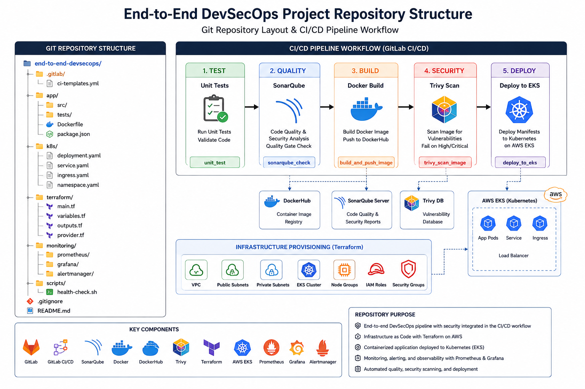

# End-to-End DevSecOps CI/CD Pipeline on AWS EKS

<p align="center">
  <strong>
    Automated CI/CD • Infrastructure as Code • Container Security • Kubernetes • AWS • Observability
  </strong>
</p>

<p align="center">
  
  
  
  
  
</p>

An end-to-end DevSecOps project demonstrating automated testing, code-quality analysis, containerization, vulnerability scanning, infrastructure provisioning, Kubernetes deployment, and monitoring on AWS.

The project integrates **GitLab CI/CD, Docker, DockerHub, SonarQube, Trivy, Terraform, Kubernetes, Amazon EKS, Prometheus, Grafana, and Alertmanager** into a complete DevSecOps workflow.

---

## 🚀 Project Overview

The project demonstrates the complete application delivery lifecycle:

```text
Developer
    |
    v
GitLab
    |
    v
Unit Tests
    |
    v
SonarQube
    |
    v
Docker Build & Push
    |
    v
Trivy Security Scan
    |
    v
Amazon EKS
    |
    v
Kubernetes Application
    |
    +----------------------+
    |                      |
    v                      v
Prometheus              Grafana
    |
    v
Alertmanager
    |
    v
Email Notifications
```

---

# 🏗️ Architecture

The project architecture combines cloud infrastructure, CI/CD, security, Kubernetes, and observability into a single workflow.

<p align="center">
  <a href="docs/architecture/architecture.png">
    
  </a>
</p>

<p align="center">
  <em>Click the diagram to open the original image.</em>
</p>

<details>
<summary><strong>Additional Architecture Documentation</strong></summary>

### Project Architecture Overview

<p align="center">
  <a href="docs/architecture/Project_Architecture_overview.jpg">
    
  </a>
</p>

### Repository Structure

<p align="center">
  <a href="docs/architecture/repository_structure.png">
    
  </a>
</p>

</details>

---

# 🔄 CI/CD Pipeline

The GitLab CI/CD pipeline automates the software delivery process through testing, code analysis, containerization, security scanning, and deployment.

<p align="center">
  <a href="docs/screenshots/ci-cd/Final_CICD_pipeline.jpg">
    
  </a>
</p>

<p align="center">
  <em>Click the screenshot to open the original full-resolution image.</em>
</p>

### Pipeline stages

| Stage                | Purpose                              |
| -------------------- | ------------------------------------ |
| **Unit Tests**       | Validate application functionality   |
| **SonarQube**        | Analyze code quality and security    |
| **Docker Build**     | Build the application container      |
| **Docker Push**      | Publish the container image          |
| **Trivy Scan**       | Scan the image for vulnerabilities   |
| **EKS Deployment**   | Deploy the application to Kubernetes |
| **Application Test** | Validate the deployed application    |

<details>
<summary><strong>Additional CI/CD Evidence</strong></summary>

### All Pipeline Stages Passed

<p align="center">
  <a href="docs/screenshots/ci-cd/all_stages_Passed.png">
    
  </a>
</p>

### Application Validation

<p align="center">
  <a href="docs/screenshots/ci-cd/Final_application_test.jpg">
    
  </a>
</p>

</details>

---

# 🐳 Docker

The application is containerized using Docker and the resulting image is published to DockerHub.

<p align="center">
  <a href="docs/screenshots/docker/Docker_overview.jpg">
    
  </a>
</p>

<p align="center">
  <em>Click the screenshot to open the original image.</em>
</p>

<details>
<summary><strong>Docker Testing Evidence</strong></summary>

<p align="center">
  <a href="docs/screenshots/docker/docker_test.png">
    
  </a>
</p>

</details>

---

# ☸️ Kubernetes & Amazon EKS

The containerized application is deployed to Kubernetes running on Amazon EKS.

<p align="center">
  <a href="docs/screenshots/kubernetes/Kubernetes_overview.jpg">
    
  </a>
</p>

### Amazon EKS Deployment

<p align="center">
  <a href="docs/screenshots/aws/EKS_deployment.jpg">
    
  </a>
</p>

<p align="center">
  <em>Click either screenshot to inspect the original image.</em>
</p>

The Kubernetes deployment demonstrates the transition from the container image to a running application in an AWS-managed Kubernetes environment.

---

# 🔐 DevSecOps Security

Security controls are integrated directly into the CI/CD pipeline.

## SonarQube

SonarQube provides automated code-quality and security analysis before deployment.

<p align="center">
  <a href="docs/screenshots/security/SonarQube.jpg">
    
  </a>
</p>

<p align="center">
  <em>Click the screenshot to inspect the original SonarQube results.</em>
</p>

## Trivy

Trivy scans the container image for known vulnerabilities before the application is deployed.

<p align="center">
  <a href="docs/screenshots/security/Trivy_overview.jpg">
    
  </a>
</p>

<details>
<summary><strong>Detailed Trivy Scan</strong></summary>

<p align="center">
  <a href="docs/screenshots/security/trivy_scan.png">
    
  </a>
</p>

</details>

---

# 📊 Monitoring & Observability

The deployed environment uses **Prometheus, Grafana, and Alertmanager** for monitoring and alerting.

<p align="center">
  <a href="docs/screenshots/monitoring/Monitoring.jpg">
    
  </a>
</p>

<p align="center">
  <em>Click the screenshot to open the original monitoring image.</em>
</p>

### Monitoring workflow

```text
Application / Kubernetes
          |
          v
      Prometheus
       /       \
      v         v
  Grafana   Alertmanager
                |
                v
        Email Notification
```

---

# 🏗️ Infrastructure as Code

Terraform is used to provision the AWS infrastructure supporting the Kubernetes deployment.

```text
Terraform
    |
    v
AWS Infrastructure
    |
    v
Amazon EKS
    |
    v
Kubernetes
    |
    v
Application
```

Infrastructure as Code makes the environment repeatable, version-controlled, and easier to manage.

> **Infrastructure lifecycle:** The AWS environment was provisioned using Terraform for deployment and testing, then destroyed after validation to avoid unnecessary cloud costs. The repository retains the Terraform configuration and screenshots documenting the completed deployment.

---

# 🔎 Project Evidence

The repository contains source code, infrastructure definitions, Kubernetes manifests, CI/CD configuration, and screenshots documenting the implementation.

| Technology       | Evidence                                 |
| ---------------- | ---------------------------------------- |
| **GitLab CI/CD** | Pipeline execution and successful stages |
| **AWS / EKS**    | EKS deployment evidence                  |
| **Kubernetes**   | Kubernetes deployment evidence           |
| **Terraform**    | Infrastructure-as-Code configuration     |
| **Docker**       | Container build and testing evidence     |
| **SonarQube**    | Code-quality and security analysis       |
| **Trivy**        | Container vulnerability scanning         |
| **Prometheus**   | Metrics and monitoring                   |
| **Grafana**      | Monitoring dashboards                    |
| **Alertmanager** | Alerting and notification workflow       |

The screenshots are provided as supporting evidence, while the repository itself contains the configuration and source files used to implement the project.

---

# 🧰 Technologies

| Category                   | Technologies                      |
| -------------------------- | --------------------------------- |
| **Cloud**                  | AWS, Amazon EKS                   |
| **Infrastructure as Code** | Terraform                         |
| **CI/CD**                  | GitLab CI/CD                      |
| **Containers**             | Docker, DockerHub                 |
| **Security**               | SonarQube, Trivy                  |
| **Orchestration**          | Kubernetes                        |
| **Monitoring**             | Prometheus, Grafana, Alertmanager |
| **Application**            | Node.js                           |

---

# 🔒 DevSecOps Practices Demonstrated

- Infrastructure as Code with Terraform
- Continuous Integration and Continuous Delivery
- Automated unit testing
- Static code analysis
- Containerization with Docker
- Container image publishing
- Container vulnerability scanning
- Kubernetes orchestration
- Amazon EKS deployment
- Application validation
- Prometheus metrics collection
- Grafana monitoring dashboards
- Alertmanager notifications
- Security integrated into CI/CD

---

# 📁 Repository Structure

```text
end_to_end_devsecops_project/
│
├── K8s/
├── docs/
│   ├── architecture/
│   │   ├── architecture.png
│   │   ├── Project_Architecture_overview.jpg
│   │   └── repository_structure.png
│   │
│   └── screenshots/
│       ├── aws/
│       ├── ci-cd/
│       ├── docker/
│       ├── kubernetes/
│       ├── monitoring/
│       └── security/
│
├── public/
├── src/
├── terraform/
├── test/
├── Dockerfile
├── .dockerignor
├── .gitignore
├── package.json
├── package-lock.json
└── README.md
```

---

# 🎯 Key Portfolio Highlights

This project demonstrates practical experience across the DevOps and DevSecOps lifecycle:

**Source Code → CI/CD → Testing → Security → Containers → Kubernetes → AWS → Monitoring**

The project combines infrastructure automation, application delivery, security scanning, Kubernetes orchestration, and observability into one end-to-end workflow.

---

# 📌 Resume Version

### End-to-End DevSecOps CI/CD Pipeline — AWS EKS

- Built an end-to-end GitLab CI/CD pipeline automating unit testing, SonarQube code analysis, Docker image build and push, Trivy vulnerability scanning, and deployment to Amazon EKS.
- Provisioned AWS infrastructure using Terraform and deployed a containerized Node.js application to Kubernetes.
- Implemented Prometheus and Grafana monitoring with Alertmanager-based alerting and email notifications.
- Integrated automated code-quality and container-security checks into the CI/CD workflow.
- Implemented application health and metrics endpoints to support Kubernetes validation and Prometheus-based observability.

---

# 🚧 Future Improvements

Potential enhancements include:

1. Demonstrate a Trivy vulnerability that intentionally blocks deployment.
2. Demonstrate a SonarQube Quality Gate failure that blocks the pipeline.
3. Add automated deployment rollback handling.
4. Add and demonstrate Kubernetes readiness and liveness probes.
5. Implement secure secrets management.
6. Add Terraform validation and plan checks to CI/CD.
7. Add infrastructure security scanning.
8. Add a concise reproduction guide for rebuilding the environment.
