# End-to-End DevSecOps CI/CD Pipeline on AWS EKS

An end-to-end DevSecOps project that automates application testing, code-quality analysis, containerization, vulnerability scanning, and deployment of a containerized application to Kubernetes running on Amazon EKS.

The project combines **GitLab CI/CD, Docker, DockerHub, SonarQube, Trivy, Terraform, Kubernetes, Amazon EKS, Prometheus, Grafana, and Alertmanager** into a single automated workflow.

## Project Architecture

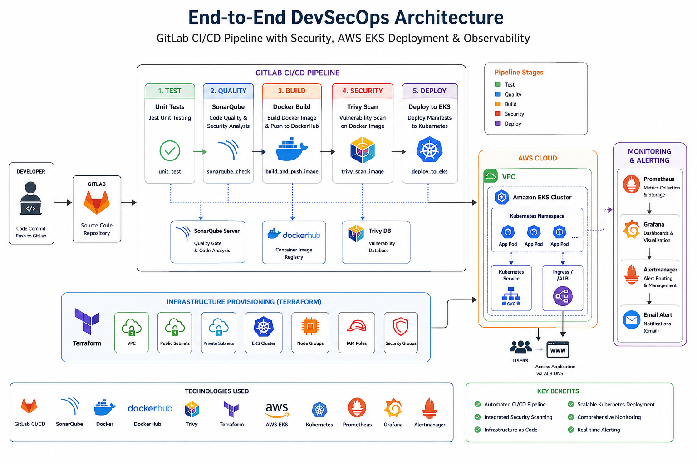

> Clean architecture diagram created specifically for this project.

## CI/CD Pipeline

The pipeline is organized into test, quality, build, security, and deployment stages.

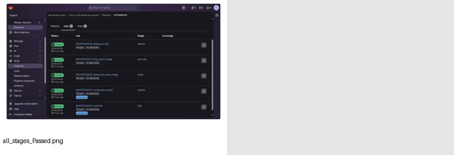

The completed workflow demonstrates:

- Unit testing
- SonarQube analysis
- Docker image build and push
- Trivy image scanning
- Deployment to Amazon EKS

### Pipeline flow

```text
GitLab
  |
  v
Unit Tests
  |
  v
SonarQube
  |
  v
Docker Build & Push
  |
  v
Trivy Image Scan
  |
  v
Deploy to EKS
```

## Docker

The application is containerized with Docker and the resulting image is pushed to DockerHub.

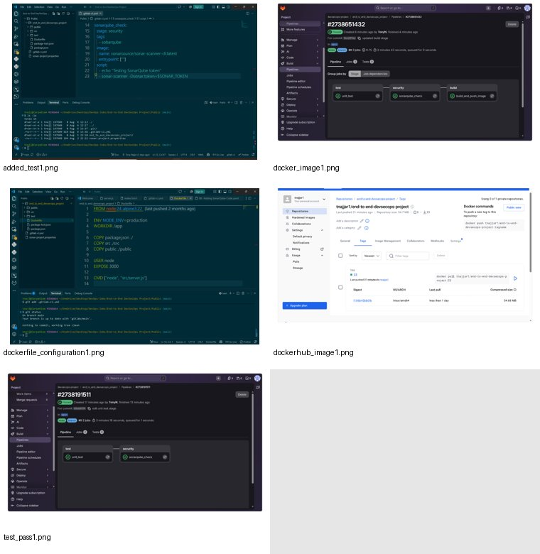

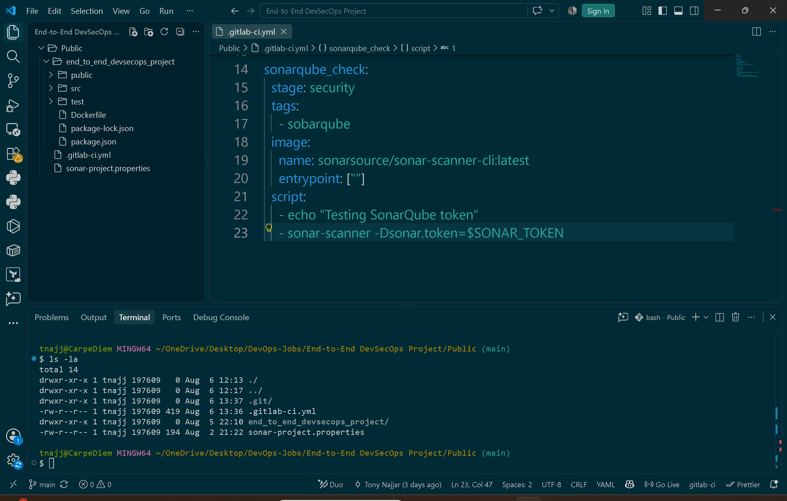

## Kubernetes and EKS

The application is deployed to Kubernetes running on Amazon EKS.

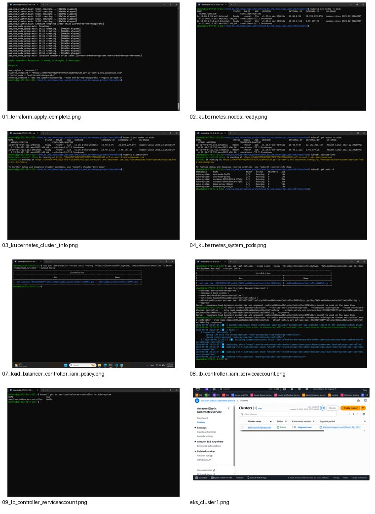

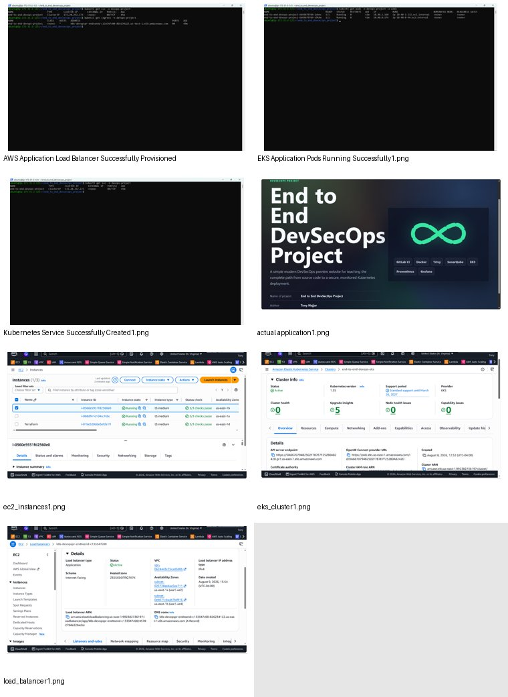

## DevSecOps Security

### SonarQube

SonarQube is integrated into the CI/CD workflow for automated code-quality and security analysis.

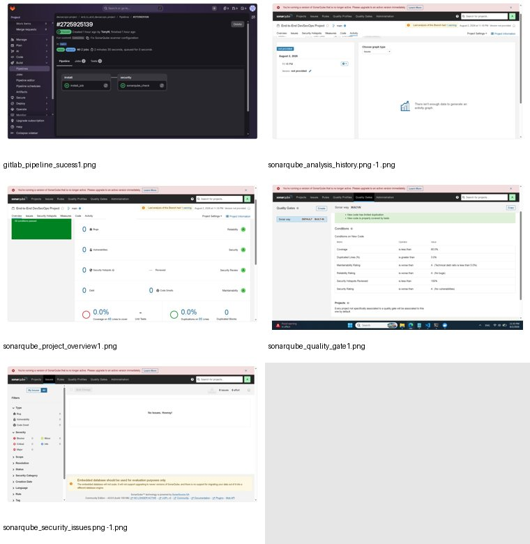

### Trivy

Trivy scans the container image for known vulnerabilities before deployment.

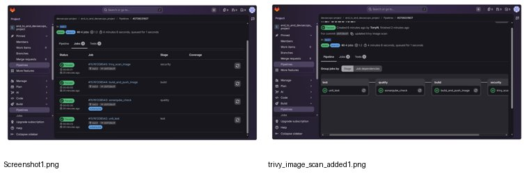

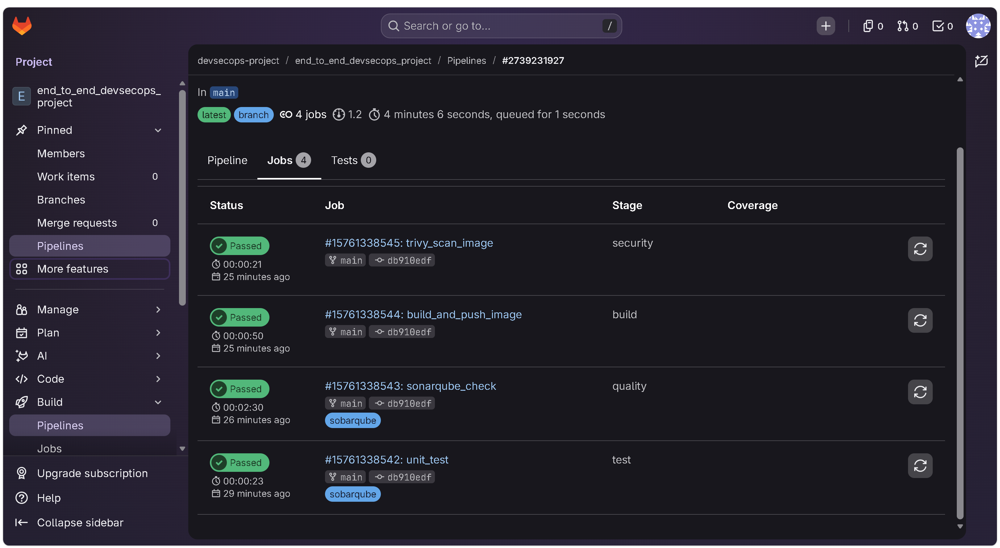

## Monitoring and Observability

The project uses Prometheus, Grafana, and Alertmanager for monitoring and alerting.

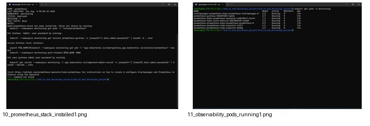

The monitoring workflow is:

```text
Application / Kubernetes
        |
        v
    Prometheus
        |
        +----> Grafana
        |
        v
   Alertmanager
        |
        v
 Email Notification
```

## Application Validation

The deployed application is tested after deployment.

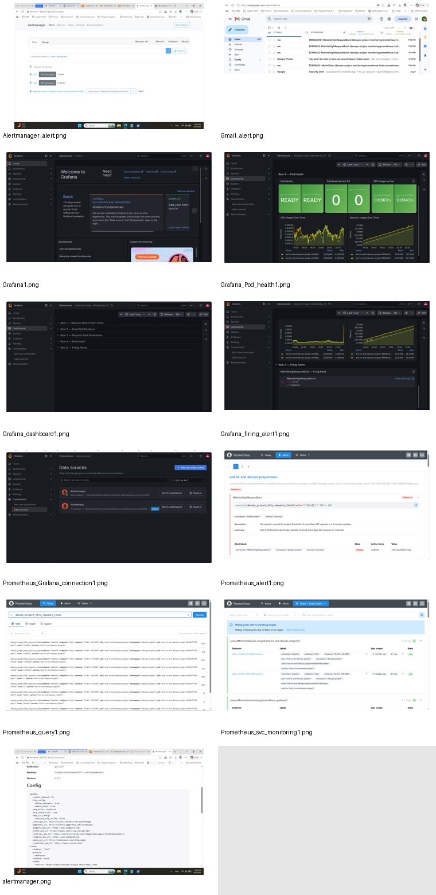

## Infrastructure as Code

Terraform is used to provision the AWS infrastructure supporting the EKS deployment.

```text
Terraform
   |
   v
AWS Infrastructure
   |
   v
Amazon EKS
   |
   v
Kubernetes
```

## Technologies

| Area | Technologies |
|---|---|
| Cloud | AWS, Amazon EKS |
| Infrastructure | Terraform |
| CI/CD | GitLab, GitLab CI/CD |
| Containers | Docker, DockerHub |
| Security | SonarQube, Trivy |
| Orchestration | Kubernetes |
| Monitoring | Prometheus, Grafana, Alertmanager |
| Application | Node.js |

## DevOps Concepts Demonstrated

- Infrastructure as Code
- Continuous Integration and Continuous Delivery
- Containerization
- Kubernetes orchestration
- AWS/EKS deployment
- Automated testing
- Static code analysis
- Container vulnerability scanning
- Application health checks
- Metrics collection
- Monitoring dashboards
- Alerting and email notifications
- Security integrated into CI/CD

## Recommended Improvements

For an even stronger portfolio project, the next improvements would be:

1. Demonstrate a deliberate Trivy failure that blocks deployment.
2. Demonstrate a SonarQube Quality Gate failure that blocks the pipeline.
3. Add deployment rollback handling.
4. Confirm readiness and liveness probes are implemented.
5. Add secure secrets management and verify no credentials are committed.
6. Add Terraform validation/plan checks to CI.
7. Replace any third-party-watermarked architecture diagram with your own clean diagram.
8. Add a concise reproduction/deployment guide.

## Resume Version

**End-to-End DevSecOps CI/CD Pipeline — AWS EKS**

- Built an end-to-end GitLab CI/CD pipeline automating unit testing, SonarQube code analysis, Docker image build/push, Trivy vulnerability scanning, and deployment to Amazon EKS.
- Provisioned AWS infrastructure using Terraform and deployed a containerized Node.js application to Kubernetes with external load-balanced access.
- Implemented Prometheus and Grafana monitoring with Alertmanager-based alerting and email notifications.
- Integrated automated code-quality and container-security checks into the CI/CD workflow to provide security controls before deployment.
- Implemented application health and metrics endpoints to support Kubernetes validation and Prometheus-based observability.

## Repository Documentation

All supporting screenshots are stored under:

```text
docs/
├── architecture/
└── screenshots/
    ├── aws/
    ├── ci-cd/
    ├── docker/
    ├── kubernetes/
    ├── monitoring/
    └── security/
```
